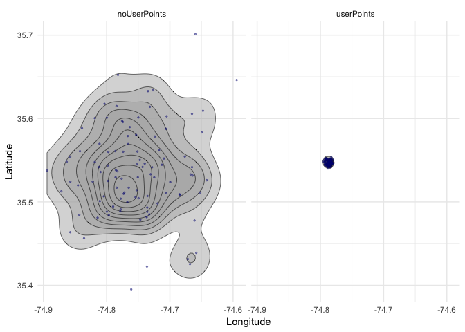

Set up:


```r
setwd("~/GitHubRepos/RepoClass")

library(dplyr)
```

```
## Warning: package 'dplyr' was built under R version 3.4.4
```

```
## 
## Attaching package: 'dplyr'
```

```
## The following objects are masked from 'package:stats':
## 
##     filter, lag
```

```
## The following objects are masked from 'package:base':
## 
##     intersect, setdiff, setequal, union
```

```r
library(readr)
```

```
## Warning: package 'readr' was built under R version 3.4.4
```

```r
library(fields)
```

```
## Warning: package 'fields' was built under R version 3.4.3
```

```
## Loading required package: spam
```

```
## Warning: package 'spam' was built under R version 3.4.4
```

```
## Loading required package: dotCall64
```

```
## Warning: package 'dotCall64' was built under R version 3.4.4
```

```
## Loading required package: grid
```

```
## Spam version 2.2-0 (2018-06-19) is loaded.
## Type 'help( Spam)' or 'demo( spam)' for a short introduction 
## and overview of this package.
## Help for individual functions is also obtained by adding the
## suffix '.spam' to the function name, e.g. 'help( chol.spam)'.
```

```
## 
## Attaching package: 'spam'
```

```
## The following objects are masked from 'package:base':
## 
##     backsolve, forwardsolve
```

```
## Loading required package: maps
```

```
## Warning: package 'maps' was built under R version 3.4.4
```

```
## See www.image.ucar.edu/~nychka/Fields for
##  a vignette and other supplements.
```

```r
library(lme4)
```

```
## Warning: package 'lme4' was built under R version 3.4.4
```

```
## Loading required package: Matrix
```

```
## Warning: package 'Matrix' was built under R version 3.4.4
```

```
## 
## Attaching package: 'Matrix'
```

```
## The following object is masked from 'package:spam':
## 
##     det
```

```r
library(ggplot2)
```

```
## Warning: package 'ggplot2' was built under R version 3.4.4
```

Read in the Data:


```r
#Read in data
#Positional data about the RV Kahuna:
kahuna <- read_csv('data/2018-11-26_2017-Cape-Hatteras-BRS-kahuna-CEE.csv')
```

```
## Parsed with column specification:
## cols(
##   date = col_character(),
##   time = col_time(format = ""),
##   longitude = col_double(),
##   latitude = col_double(),
##   ship = col_character(),
##   status = col_character()
## )
```

```r
kStart <- kahuna %>% 
  filter(status == 'start')
```

```
## Warning: package 'bindrcpp' was built under R version 3.4.4
```

```r
# Read in Gm182 Data: 100 estimated positions of Gm182, augmented with focal follow data
gm182UP <- read_csv('data/2018-11-27_Gm182-UserPoints-Start-CEE-Locations-Kahuna.csv') %>% 
  mutate(status = 'userPoints')
```

```
## Parsed with column specification:
## cols(
##   trackNum = col_double(),
##   time = col_datetime(format = ""),
##   dfOrig.x = col_double(),
##   dfOrig.y = col_double()
## )
```

```r
# Read in Gm182 Data: 100 estimated positions of Gm182
gm182 <- read_csv('data/2018-11-27_Gm182-Start-CEE-Locations-Kahuna.csv') %>% 
  mutate(status = 'noUserPoints')
```

```
## Parsed with column specification:
## cols(
##   trackNum = col_double(),
##   time = col_datetime(format = ""),
##   dfOrig.x = col_double(),
##   dfOrig.y = col_double()
## )
```

Minimal Wrangling of the Data:


```r
# Minimal Wrangling of the data
gmpts <- bind_rows(gm182, gm182UP)
colnames(gmpts) <- c('trackNum', 'time', 'longitude', 'latitude', 'status')
```

Plot the Points:


```r
# Plot the points out:
ggplot(gmpts, aes(longitude, latitude, group = status))+
  scale_fill_gradient(low = "grey70", high = "grey30", guide = "none") +
  xlab("Longitude") +
  ylab("Latitude") +
  theme_minimal()+
  facet_grid(~ status, labeller = label_value) +
  stat_density_2d(aes(fill = ..level..), geom = "polygon", color = "black", size = 0.2, alpha = 0.5) +
  geom_point(color = "navy", size = .5, alpha = .4)
```

<!-- -->

Calculate the distances between pilot whale and the ship:


```r
# Analysis Section
# Calculate distance to ship at the start of the CEE
gmpts$d2ship <- rdist.earth.vec(cbind(kStart$longitude, kStart$latitude), 
                                cbind(gmpts$longitude, gmpts$latitude))

gmpts %>% 
  group_by(status) %>% 
  summarize(mean = mean(d2ship, na.rm = TRUE))
```

```
## # A tibble: 2 x 2
##   status        mean
##   <chr>        <dbl>
## 1 noUserPoints 4.43 
## 2 userPoints   0.962
```

Test the distance:


```r
# Test the distance
gmpts.fit <- with(gmpts, lmer(d2ship ~ status + (1 | trackNum)))
gmpts.fit
```

```
## Linear mixed model fit by REML ['lmerMod']
## Formula: d2ship ~ status + (1 | trackNum)
## REML criterion at convergence: 793.1435
## Random effects:
##  Groups   Name        Std.Dev.
##  trackNum (Intercept) 0.09385 
##  Residual             1.74937 
## Number of obs: 200, groups:  trackNum, 100
## Fixed Effects:
##      (Intercept)  statususerPoints  
##            4.427            -3.465
```

```r
summary(gmpts.fit)
```

```
## Linear mixed model fit by REML ['lmerMod']
## Formula: d2ship ~ status + (1 | trackNum)
## 
## REML criterion at convergence: 793.1
## 
## Scaled residuals: 
##     Min      1Q  Median      3Q     Max 
## -2.0117 -0.1996 -0.0319  0.1487  4.4918 
## 
## Random effects:
##  Groups   Name        Variance Std.Dev.
##  trackNum (Intercept) 0.008808 0.09385 
##  Residual             3.060296 1.74937 
## Number of obs: 200, groups:  trackNum, 100
## 
## Fixed effects:
##                  Estimate Std. Error t value
## (Intercept)        4.4275     0.1752   25.27
## statususerPoints  -3.4652     0.2474  -14.01
## 
## Correlation of Fixed Effects:
##             (Intr)
## statssrPnts -0.706
```
